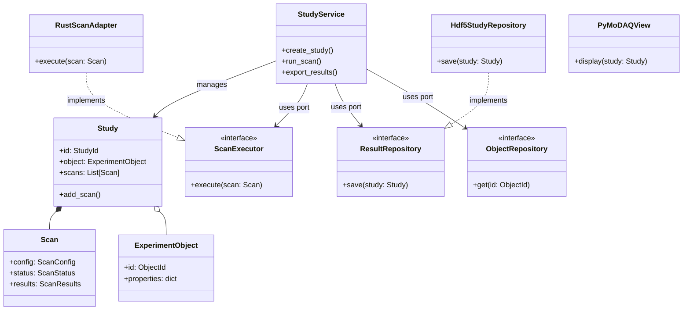
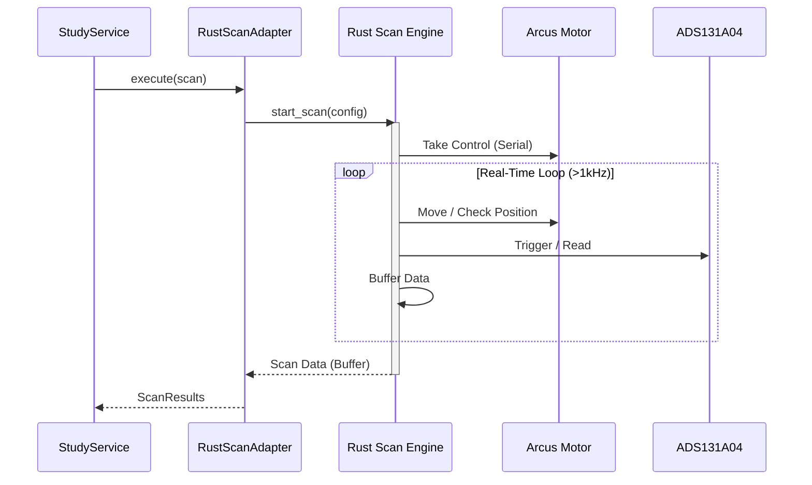

# Target Architecture: AEFI Acquisition Refactoring

This document outlines the architectural vision for the refactored AEFI Acquisition software. It combines **Domain-Driven Design (DDD)**, **Hexagonal Architecture (Ports & Adapters)**, and a high-performance **Rust-based Scan Engine** to address the limitations of the legacy system.

## 1. Architectural Principles

*   **Hexagonal Architecture**: The core business logic (Domain) is isolated from the outside world (GUI, Hardware, Database).
*   **Domain-Driven Design (DDD)**: The software models the real-world physics and workflow of the experiment (`Study`, `Scan`, `ExperimentObject`).
*   **Hybrid Python/Rust**: Critical real-time loops are offloaded to Rust for performance (Flyscan), while high-level orchestration remains in Python.
*   **PyMoDAQ Integration**: The system leverages PyMoDAQ for the GUI and standard hardware control, but via strictly defined adapters.

## 2. High-Level Architecture (Hexagonal)

The system is divided into three concentric layers:



### Layers Description

1.  **Domain Layer (Core)**:
    *   Contains the "Truth" of the acquisition process.
    *   **Key Entities**: `Study`, `Scan`, `ExperimentObject`.
    *   **Key Value Objects**: `ExcitationConfig`, `FrameRotation`, `ScanPattern`.
    *   *No dependencies on PyMoDAQ, Rust, or HDF5.*

2.  **Application Layer (Use Cases)**:
    *   Orchestrates the domain objects to perform tasks.
    *   **Service**: `StudyService` handles the workflow (e.g., "Run a scan for this study").
    *   **Ports**: Defines interfaces for external tools (`ScanExecutor`, `ResultRepository`).

3.  **Infrastructure Layer (Adapters)**:
    *   **RustScanAdapter**: Implements `ScanExecutor`. Converts domain scans into commands for the Rust engine.
    *   **Hdf5StudyRepository**: Implements `ResultRepository`. Saves data to HDF5 files.
    *   **PyMoDAQView**: The GUI. Subscribes to domain events to update plots.

## 3. The Rust Scan Engine (Flyscan)

To achieve high-speed continuous acquisition ("Flyscan"), we bypass the Python GIL using a Rust extension.



*   **Responsibility**: The Rust engine takes *exclusive* control of the hardware during the scan to ensure deterministic timing.
*   **Integration**: Exposed to Python via `PyO3`.

## 4. PyMoDAQ Integration Strategy

We use PyMoDAQ for its ecosystem (GUI, Plugins) but invert the dependency direction.

```mermaid
graph TD
    subgraph "Legacy Drivers (Reused)"
        Driver1[Arcus Driver]
        Driver2[Agilent Driver]
        Driver3[Narda Driver]
    end

    subgraph "PyMoDAQ Plugins (New Wrappers)"
        Plugin1[daq_move_Arcus]
        Plugin2[daq_1Dviewer_Agilent]
        Plugin3[daq_0Dviewer_Narda]
    end

    subgraph "Infrastructure Layer"
        GUI[PyMoDAQ Dashboard]
        Adapter[RustScanAdapter]
    end

    subgraph "Domain Layer"
        Logic[Acquisition Logic]
    end

    Driver1 --> Plugin1
    Driver2 --> Plugin2
    Driver3 --> Plugin3

    Plugin1 --> GUI
    Plugin2 --> GUI
    Plugin3 --> GUI

    GUI -.-> Logic : Observes
    Logic --> Adapter : Uses
    Adapter -.-> Plugin1 : Controls (Step Scan)
    Adapter -.-> RustEngine : Controls (Flyscan)
```

*   **Legacy Drivers**: Reused as-is, wrapped in `pymodaq_plugins_aefi`.
*   **Step Scan**: Can be performed via standard PyMoDAQ plugins.
*   **Flyscan**: Performed via the specialized `RustScanAdapter` which may bypass standard plugins for performance.

## 5. Directory Structure

```
AEFI_Acquisition_App/
├── src/
│   └── aefi_app/
│       ├── domain/             # Pure Python, Business Logic
│       │   ├── entities/
│       │   ├── value_objects/
│       │   └── ports/          # Interfaces
│       ├── application/        # Use Cases, Services
│       └── infrastructure/     # Adapters
│           ├── adapters/       # RustAdapter, Hdf5Adapter
│           └── pymodaq/        # GUI & Plugin integration
└── tests/
```
